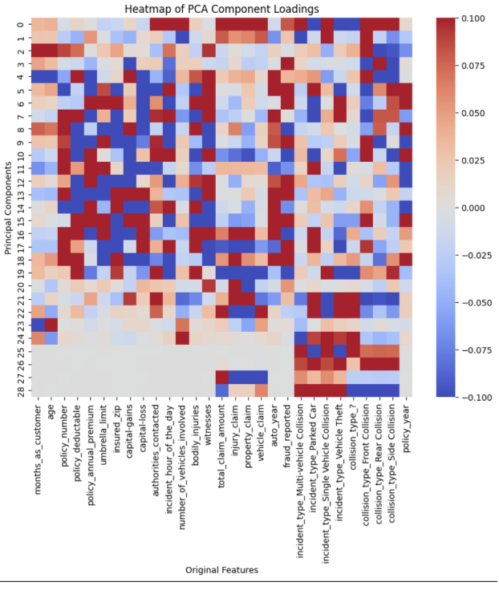
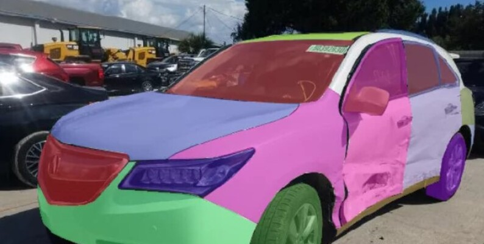
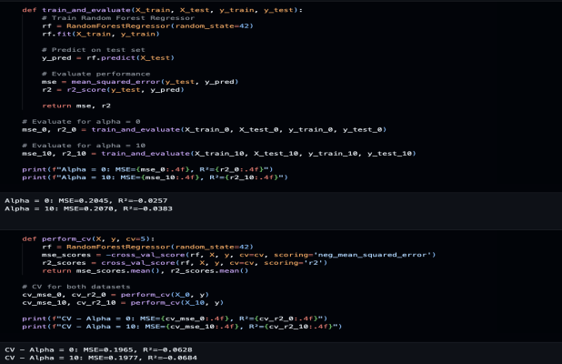

# Capstone-Fraud-Detection
Collection of Progress on my Boston Unversity Capstone on Creating a Property Damage Detection/Fraud Detection AI Model.

# Problem Statement

Every year, property damage fraud is estimated to cost the shareholders $40 billion in
fraudulent claims. This accounts to $400-700 of each policyholder’s premium going into paying
out these frauds.

This is my project page for my goal of devloping an comprehensive large language model on fraud detection using text/image database.

## Project Lifecycle
### ✅ Problem Identification and Planning
> [//]: # (callout;icon-type=icon;icon=sun;color=#fc551f)
> Confirmed no comprehensive solution on AI model that can detect fraud on property (real estate/automotive) damage.

> [//]: # (callout;icon-type=icon;icon=sun;color=#fc551f)
> Define impact of the solution: Significant increase on policy fees of the regular policyholders' (https://www.fbi.gov/stats-services/publications/insurance-fraud)
### ✅ Data Collection/Viability Check

> [//]: # (callout;icon-type=icon;icon=sun;color=#fc551f)
> Confirmed there exists a non-enterprise level data bases to continue on with the project.

> [//]: # (callout;icon-type=icon;icon=sun;color=#fc551f)
> Demographic/Claim Information: (https://data.mendeley.com/datasets/992mh7dk9y/2)

> [//]: # (callout;icon-type=icon;icon=sun;color=#fc551f)
> Imagery: (https://www.kaggle.com/datasets/humansintheloop/car-parts-and-car-damages/data)

### ✅ Data Validation/Cleaning/Pre-processing
> [//]: # (callout;icon-type=icon;icon=sun;color=#fc551f)
> Delete/Hot-encode missing and incomplete data

> [//]: # (callout;icon-type=icon;icon=sun;color=#fc551f)
> Complete Exploratory Data Analysis to confirm feasibility of data

### ⏳ Data Analysis
> [//]: # (callout;icon-type=icon;icon=sun;color=#fc551f)
> Validate best principal components, statistical methods, and training methods for the data using parameter sweep, bi/univariate analysis, cross-validation of regressors and samples.

### 🧠 Model Building

### 🧠 Model Evaluation

### 🧠 Model Deployment
